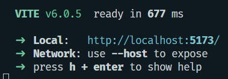

# Pasos para crear una App React usando Vite

1. Para comenzar un proyecto React con Vite usamos el siguiente comando:

```bash
$ npm create vite@latest
```

2. A partir de este comando, comenzara a realizar una serie de preguntas, pedira el nombre del proyecto

```bash
 √ Project name: mi-primer-proyecto-react
```

3. Luego solicitará la tecnología o framework que va a usar. En este caso React.

```bash
? Select a framework: » - Use arrow-keys. Return to submit.
    Vanilla
    Vue
>   React
    Preact
    Lit
    Svelte
    Solid
    Qwik
    Angular
    Others
```

4. Vite ya te puede dejar todo listo para comenzar a trabajar con TypeScript, pero vamos a trabajar con Javascript. Además, en la imagen te ofrecen una alternativa llamada "SWC". Esto es un reemplazo de Babel usando un software llamado SWC que está basado en Rust, que es un poco más rápido que el propio Babel.
   Babel es una herramienta para la transpilación del código Javascript

```bash
? Select a variant: » - Use arrow-keys. Return to submit.
    TypeScript
    TypeScript + SWC
    JavaScript
>   JavaScript + SWC
    React Router v7 ↗
```

5. Al dar enter se habra generado el esqueleto de archivos y carpetas.

6. Ahora se podrá arrancar el proyecto para verlo en el navegador realizando los siguientes pasos:

```bash
Done. Now run:

  cd prueba-react-vite1
  npm install
  npm run dev
```

7. Aparecera en la terminal la siguiente imagen:

!
